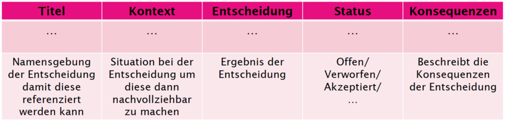

# Hello World

## Foo
bar

## Bar
foo

## Ressources
[FHTW Homepage](www.technikum-wien.at)

## Show how to use MD

Markdown editor of IntelliJ allows to drag'n'drop images into the editor directly.
It will automatically generate the png-file and the corresponding !-link into the md file.
Use the refactoring functions to change the directory or name of the image file.

